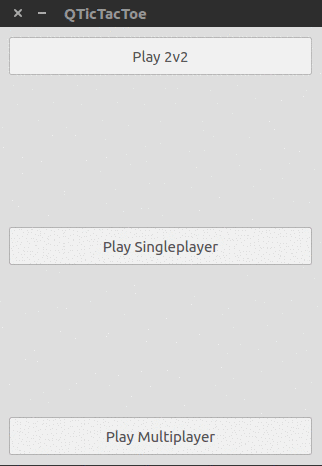

# QTicTacToe
[](https://dawidd6.github.io/qtictactoe)
[](https://cirrus-ci.com/github/dawidd6/qtictactoe)

### Install from PPA

```sh
sudo add-apt-repository ppa:dawidd0811/qtictactoe
sudo apt-get update
sudo apt-get install qtictactoe
```

### Game modes:
- two on one mouse
- through sockets
- versus computer

### GIF

